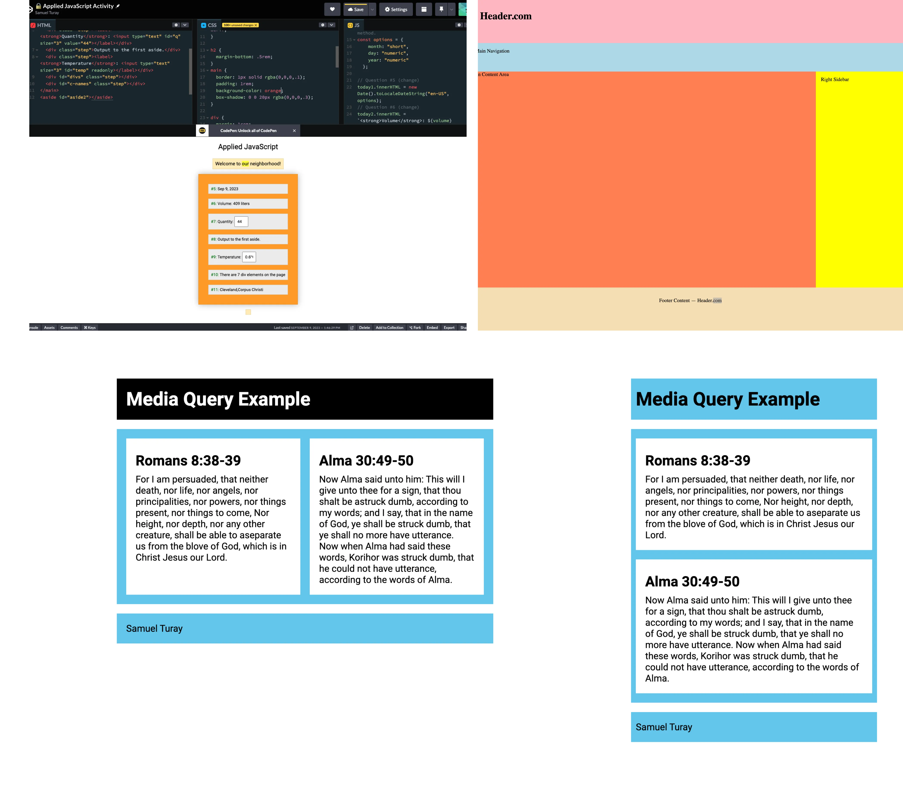

  

# wdd230 - Web Frontend 1

**wdd230 Web Frontend 1** is a 3 credit course focused on planning, designing, and developing responsive website with HTML, CSS and JavaScript. Paying attention to usability, accessibility, and best practices in the world of Frontend Development.  
This is a block course, meaning, it's 14 weeks semester course, crunched to a 7 week semester course. The course is structured in this way: Per week ↓  
| Learning activities 🎯| Team activities 🤝| Team discussions 👥| Assignments 📚| Course Project 🧪|
| :-------: | :--------: | :---------: | :----------: | :------------: |

---

### The Course outcome:

- Develop semantic and valid webpages, using contemporary HTML5 syntax.
- Styling webpages using modern, valid, contemporary CSS (Cascading Style Sheets).
- Produce visually appealing, and usable content. Accessible by both humans and machines.
- Using best practices in organizing and maintaining site plan, design and development.
- Work with JavaScript to handle events and interactions within the browser icluding JSON and remote APIs.
- Developing or Improving softskills by working in a team, learning collaboratively, communicating clearly, fulfilling assignments, and meeting deadlines.

---

## Week-01:

Week-01 is about refreshing our Web Dev knowledge since we have been on break for quite a while. So, we are cobwebbing the tech fatigue and imposter syndrome (at least for me 😃) with learning activities that include basic grid layout refactoring the **Holy Grail** layout, and some media-query. Also, we had to dust up our JavaScript knowledge with a codepen exercise.

